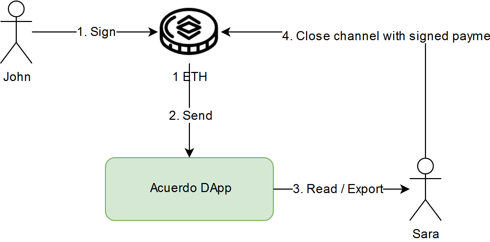
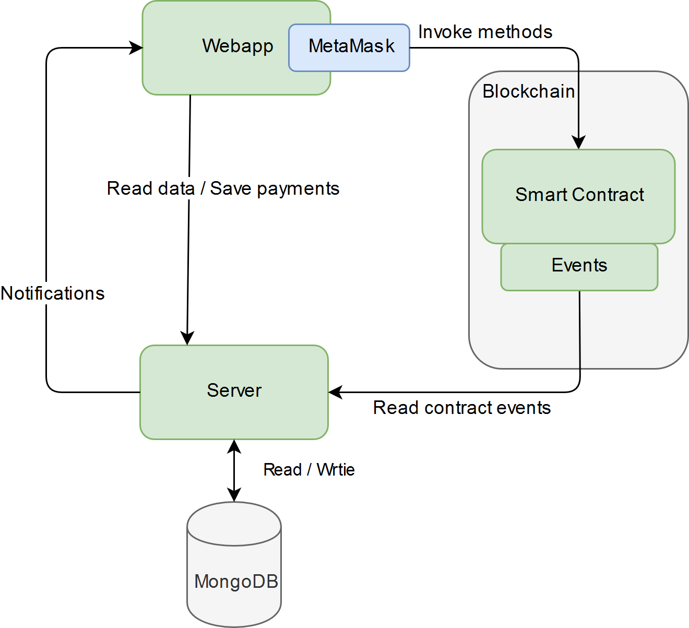

[Logo](./docs/images/logo-colored.png)

Ethereum Payment DApp on Payment Channels

## About
Acuerdo is a DApp based on Payment Channels for Ethereum users 
to proceed micro-payments within channel and 
to commit channel state to blockchain.
Acuerdo provides fast and cheap way to pay for services or goods.

### Acuerdo Smart Contract
[Channels.sol](./smart-contract/contracts/Channels.sol)

### Main process


### Payout and sign 



## Architecture




## Build and Run

```
cd deployment && ./start.sh (:tbd)
```


